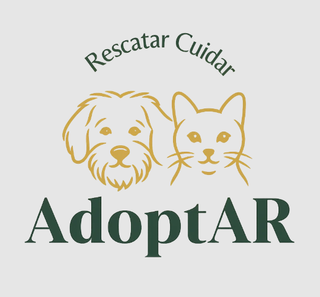

<a name="readme-top"></a>
# PPS UTN – Tecnicatura Universitaria en Programación 2026

<!-- PROJECT LOGO -->
<br />
<div align="center">
  <a href="./documentacion/AdoptAR_Documentación_PSS.docx.pdf">
    
  </a>

  <h3 align="center">AdoptAR</h3>

  <p align="center">
    <a href="./documentacion/AdoptAR_Documentación_PSS.docx.pdf">
    <strong>Acceda a la documentación del proyecto »</strong></a>
  </p>
</div>

## Sobre el proyecto

AdoptAR es una aplicación web que facilita la publicación de mascotas en adopción. Permite a usuarios hacer las publicaciones con el detalle de cada mascota y gestionar las visitas para concretar la adopción.

## Alcance del sistema

<ul>
  <li>Permitir el registro e inicio de sesión de usuarios.</li>
  <li>Permitir a los usuarios registrados la creación, actualización y borrado de perfiles de mascotas en adopción.</li>
  <li>Permitir la publicación de mascotas con la información necesaria para facilitar la búsqueda a los usuarios interesados en adoptar.</li>
  <li>Permitir a los publicadores la opción de cargar sus datos bancarios para recibir donaciones para las mascotas en adopción.</li>
  <li>Permitir a los administradores de la web controlar la publicación de todas las mascotas de los usuarios registrados, para velar por su correcto uso y también obtener métricas relevantes, sobre la cantidad total de usuarios registrados, cantidad total de mascotas, publicaciones y visitas creadas.</li>
  <li>Permitir a los visitantes de la página, cargar formularios para coordinar una visita con la mascota de interés.</li>
  <li>Permitir a los publicadores gestionar sus publicaciones  y aceptar o rechazar las visitas dependiendo de su disponibilidad.</li>

</ul>

## Tecnologías

<ul>
  <li>Frontend: Next.js, TypeScript, Tailwind CSS.</li>
  <li>Backend: NestJS, TypeScript.</li>
  <li>Base de datos: PostgreSQL.</li>
  <li>ORM: Sequelize con Sequelize-TypeScript.</li>
  <li>Autenticación: JWT.</li>
  <li>Validación de datos: class-validator, class-transformer.</li>
  <li>Testing: Jest.</li>
</ul>

## Colaboradores

<ul>
  <li>Fresco, Federico. - fedef1982@gmail.com</li>
  <li>Rodríguez, Paola - paolarladera@gmail.com</li>
</ul>


## Project setup

<p>Acceda al <a href="instalacion.md">manual de instalación</p>

## Compilar y levantar el proyecto

```bash

# levantar solo Backend
$ cd backend && npm run start:dev

# levantar solo Frontend
$ cd frontend && pnpm run dev

```

## Run tests

```bash
# unit tests
$ cd backend && npm run test

# test coverage
$ npm run test:cov
```
<p align="right">(<a href="#readme-top">back to top</a>)</p>
