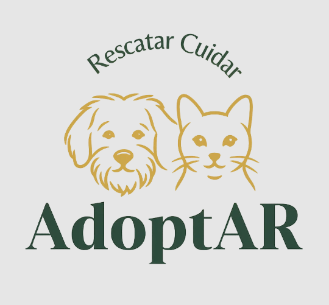

<!-- PROJECT LOGO -->
 

  

  <h3 align="center">AdoptAR</h3>

  

    <a href="https://francisluna.github.io/ToDo-POO-Grupo-9/"><strong>Accede a la documentación »</strong></a>
  

## Sobre el proyecto

AdoptAR es una aplicación web que facilita la publicación de mascotas en adopción. Permite a usuarios hacer las publicaciones con el detalle de cada mascota y gestionar las visitas para concretar la adopción.

## Alcance del sistema

<ul>
  <li>Registro de usuarios.</li>
  <li>Sistema de autenticación y control de acceso por rol (admin, publicador).</li>
  <li>Publicación de mascotas en adopción (con fotos e información relevante).</li>
  <li>Gestión de formularios de visita creados por los usuarios interesados en la adopción.</li>
  <li>Seguimiento del estado de formularios de visita.</li>

</ul>

## Tecnologías

<ul>
  <li>Frontend: Next.js, TypeScript, Tailwind CSS.</li>
  <li>Backend: NestJS, TypeScript, Sequelize.</li>
  <li>Base de datos: PostgreSQL.</li>
  <li>Autenticación: JWT.</li>
  <li>ORM: Sequelize-TypeScript.</li>
</ul>

## Colaboradores

<ul>
  <li>Fresco, Federico. - fedef1982@gmail.com</li>
  <li>Reina, Adriel - adriel.a.reina@gmail.com</li>
  <li>Velardez, Marcos - marcosvelardez40@gmail.com</li>
  <li>Rodríguez, Paola - paolarladera@gmail.com</li>
</ul>

(<a href="#readme-top">back to top</a>)
